# Performance Testing Result

## Before Optimization

### Test Plan 1: /all-student-request
- View Result Tree
  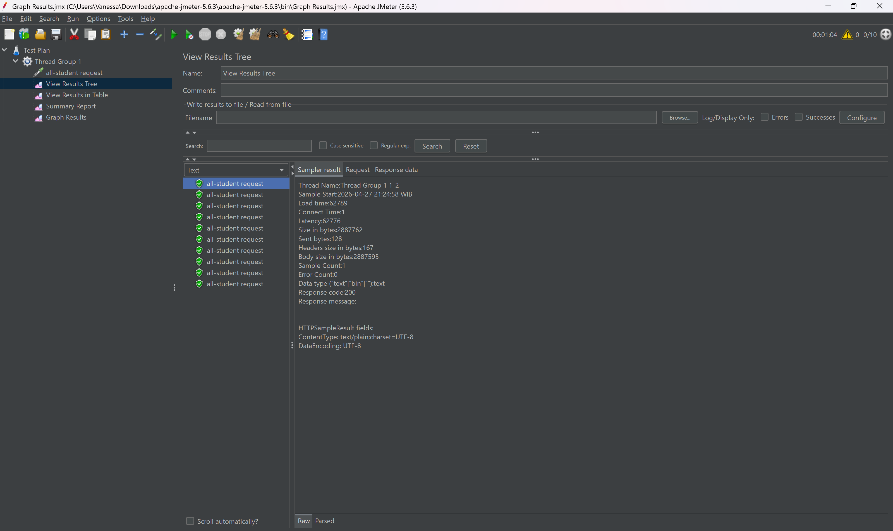
- View Results in Table
  
- Summary Report
  
- Graph Results
  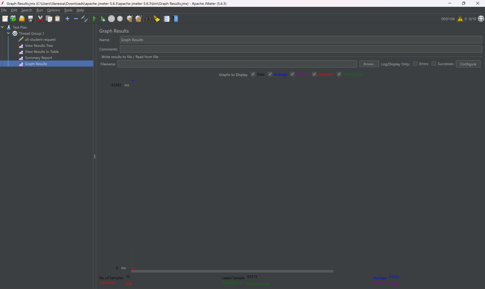

### Test Plan 2: /all-student-name
- View Result Tree
  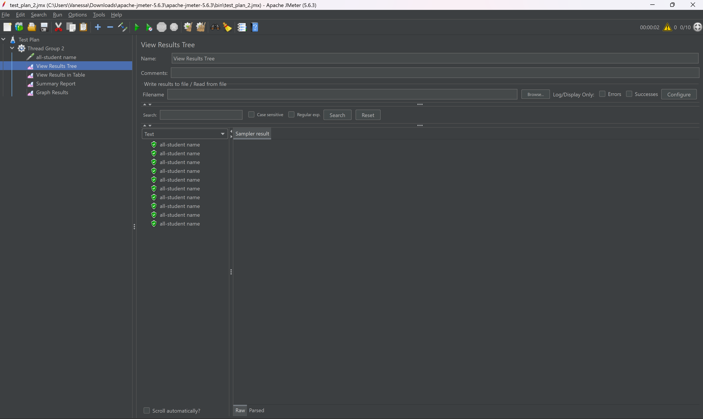
- View Results in Table
  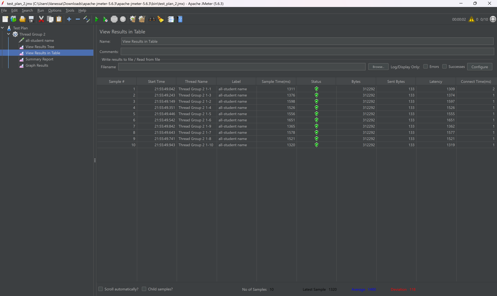
- Summary Report
  
- Graph Results
  

### Test Plan 3: /highest-gpa
- View Result Tree
  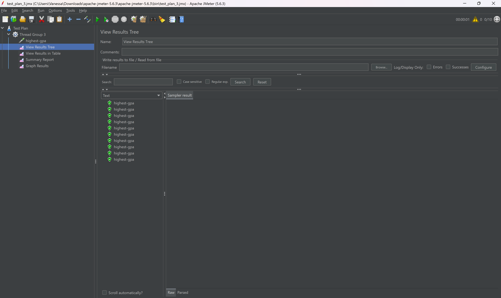
- View Results in Table
  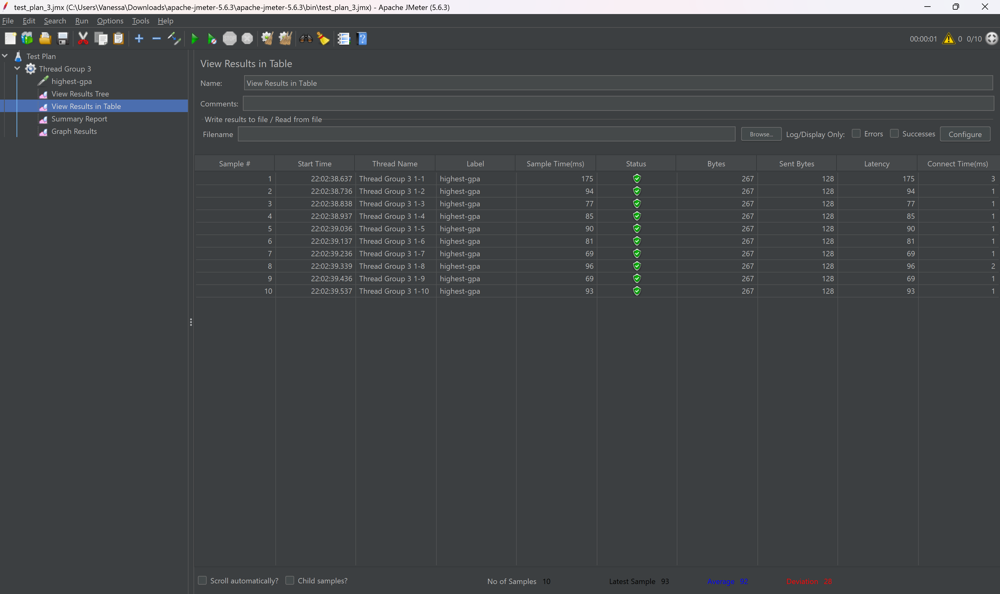
- Summary Report
  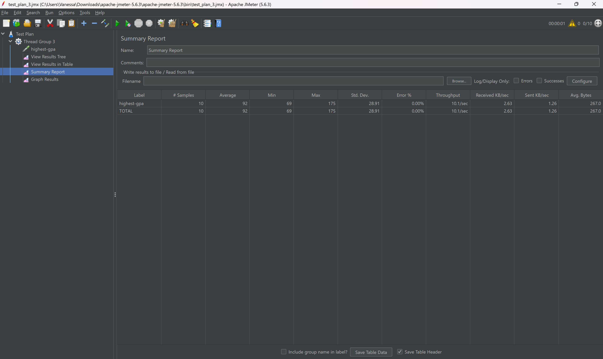
- Graph Results
  

Using Command Line:
/all-student-request
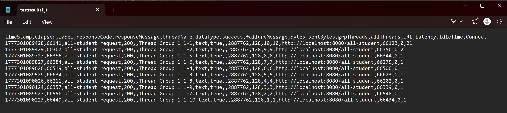

/all-student-name
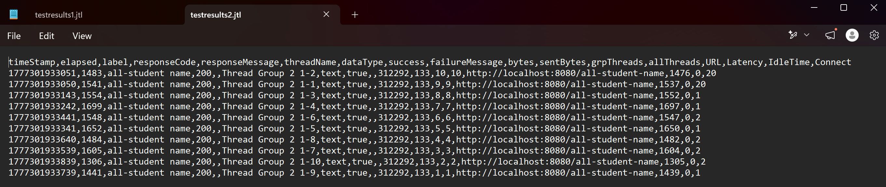

/highest-gpa 
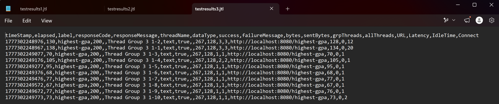

## After Optimization
/all-student-request after

/all-student-name after
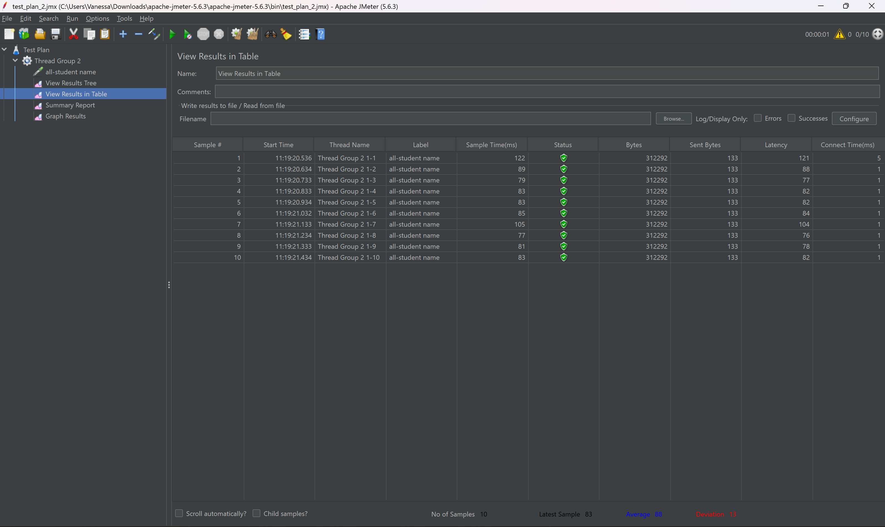

/highest-gpa after

## Profiling
/all-student-request after
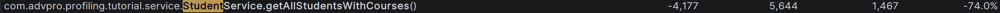

/all-student-name after
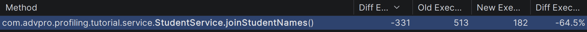

/highest-gpa after
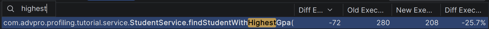

## Conclusion
Secara keseluruhan, hasil optimasi yang dilakukan menunjukkan peningkatan performa yang signifikan dan konsisten, baik dari sisi pengukuran JMeter maupun IntelliJ Profiler. Pada endpoint /all-student, refactoring method getAllStudentsWithCourses() dari pendekatan nested loop dengan N+1 query menjadi studentCourseRepository.findAll() berhasil menurunkan CPU time sebesar 74.0% (dari 5.644 ms menjadi 1.467 ms) berdasarkan profiling, dan rata-rata sample time JMeter turun drastis dari 63.322 ms menjadi 4.765 ms. Pada endpoint /all-student-name, perubahan method joinStudentNames() dari konkatenasi string dalam loop menjadi stream().map().collect(Collectors.joining()) menghasilkan penurunan CPU time sebesar 64.5% (dari 513 ms menjadi 182 ms) pada profiling, dan hasil JMeter pun mengkonfirmasi peningkatan yang besar dengan sample time turun dari 1.480 ms menjadi 88 ms. Pada endpoint /highest-gpa, penggantian loop manual dengan stream().max() memberikan peningkatan CPU time sebesar 25.7% (dari 280 ms menjadi 208 ms) dan sample time JMeter turun dari 139 ms menjadi 74 ms. Kesimpulannya, ketiga optimasi yang dilakukan terbukti efektif dan hasil JMeter sepenuhnya sejalan dengan temuan profiling, mengkonfirmasi bahwa eliminasi N+1 query dan penggunaan stream API memberikan dampak nyata terhadap performa aplikasi secara end-to-end.

## Reflection
> What is the difference between the approach of performance testing with JMeter and profiling with IntelliJ Profiler in the context of optimizing application performance?

JMeter dan Intellij Profiler memiliki sudut pandang yang berbeda. JMeter bekerja dari sisi luar, mengukur bagaimana aplikasi berperilaku dari perspektif pengguna dengan mensimulasikan banyak request secara bersamaan melalui metrik seperti sample time, throughput, dan latency. JMeter memberi tahu apakah ada masalah performa, tetapi tidak menjelaskan di mana dan mengapa. Sedangkan IntelliJ Profiler, bekerja di sisi dalam, merekam eksekusi kode secara langsung dan menampilkan detail seperti CPU time per method, flame graph,dan timeline thread. Profiler yang menjawab pertanyaan mengapa suatu endpoint lambar dengan menunjuk langsung ke baris kode atau method yang menjadi penyebabnya. Dalam konteks optimasi, secara garis besar, JMeter mendeteksi adanya masalah performa, sementara Profiler menjawab mengapa dan di mana tepatnya bottleneck tersebut terjadi di kode.

> How does the profiling process help you in identifying and understanding the weak points in your application?

Proses profiling sangat membantu karena memberikan visibilitas langsung ke dalam eksekusi kode yang tidak bisa didapatkan hanya dari pengujian eksternal. Melalui flame graph, saya dapat melihat langsung secara visual method mana yang paling banyak mengonsumsi CPU berdasarkan lebar bloknya. Kemudian melalui method list, dapat dibandingkan CPU time setiap method secara terurut, sehingga prioritas optimasi menjadi jelas. Dalam modul ini, profiling mengidentifikasi method getAllStudentWithCourses() melakukan N+1 query. Tanpa profiling, masalah ini sulit ditemukan hanya dengan membaca kode karena secara logika kode tersebut terlihat benar.

> Do you think IntelliJ Profiler is effective in assisting you to analyze and identify bottlenecks in your application code?

Iya, menurut saya, IntelliJ sangat efektif. Fitur flame graph memudahkan identifikasi method yang paling boros secara visual tanpa harus membaca kode satu per satu, sementara fitur method list dengan kolom CPU time memberikan perbandingan waktu eksekusi antar method secara kauntitatif. Fitur yang paling berguna adalah fitur comaprison view, di mana membuat saya dapat membandingkan sesi sebelum dan sesudah optimasi. Hasilnya langsung menampilkan selisih CPU time dan persentase perubahnnya, seperti yang terlihat pada hasil optimasi saya yang menunjukkan penurunan CPU time secara signifikan. Selain itu, integrasi langsung dengan IDE memudahkan navigasi dari hasil profiling ke source code yang bermasalah juga memudahkan untuk refactoring.

> What are the main challenges you face when conducting performance testing and profiling, and how do you overcome these challenges?

Tantangan utama adalah ketidak konsistenan hasil pengukururan, terutama pada run pertama aplikasi, di mana JIT compiler belum optimal sehingga waktu eksekusi biasanya lebih lambat karena kode belum dioptimasi oleh compiler. Saya mengatasinya dengan mengakses endpoint beberapa kali, lalu baru mengambil merekam data. Tantangan lainnya adalah menginterpretasikan hasil profiling yang kompleks, terutama membedakan CPU time dan total time serta menentukan method mana yang benar-benar perlu dioptimasi. Hal ini diatasi dengan fokus pada CPU time dan mengabaikan method framework (Spring). Terakhir, untuk menjaga fungsionalitas, saya melakukan pengujian manual pada output endpoint untuk memastikan data yang dihasilkan tetap sama setelah dioptimasi.

> What are the main benefits you gain from using IntelliJ Profiler for profiling your application code?

Manfaat utama IntelliJ Profiler adalah kemampuannya untuk mempersingkat waktu debugging performa secara signifikan. Tanpa profiler, menemukan bottleneck di aplikasi dengan banyak layer (controller, service, repository) bisa memakan waktu sangat lama karena harus menelusuri kode secara manual. Dengan profiler, proses identifikasi dapat dilakukan dalam hitungan menit. Selain itu, profiler memberikan data kuantitatif yang objektif sehingga keputusan optimasi didasarkan pada bukti nyata, bukan asumsi. Fitur comparison view juga sangat bermanfaat karena memungkinkan validasi hasil optimasi secara langsung, apakah perubahan yang dilakukan benar-benar memberikan peningkatan dan seberapa besar peningkatannya. Manfaat lain adalah integrasi seamless dengan IntelliJ IDEA sehingga tidak perlu berpindah alat untuk mulai melakukan analisis.

> How do you handle situations where the results from profiling with IntelliJ Profiler are not entirely consistent with findings from performance testing using JMeter?

Inkonsistensi ini biasanya terjadi karena perbedaan cakupan pengukuran. JMeter mengukur end-to-end response time (termasuk network latency, serialisasi JSON, dan connection pooling), sementara profiler lebih fokus pada eksekusi internal method. Ketika terjadi inkonsistensi, langkah pertama adalah memeriksa kondisi pengukuran, apakah JVM sudah dalam kondisi warm saat pengukuran dilakukan, apakah jumlah data di database sama, dan apakah tidak ada proses lain yang membebani sistem. Jika setelah dikontrol semua variabelnya hasil masih berbeda, maka kemungkinan ada faktor di luar method yang dioptimasi yang menjadi bottleneck baru, seperti serialisasi response JSON untuk dataset yang besar. Dalam situasi tersebut, profiling perlu diulangi sambil memperhatikan keseluruhan call stack, tidak hanya satu method saja.

> What strategies do you implement in optimizing application code after analyzing results from performance testing and profiling? How do you ensure the changes you make do not affect the application's functionality?

Strategi optimasi dimulai dengan mengidentifikasi root cause dari bottleneck yang ditemukan profiler. Pada kasus ini, ditemukan tiga pola masalah, yaitu N+1 query pada getAllStudentsWithCourses() yang diselesaikan dengan mengganti nested loop menjadi satu pemanggilan findAll() langsung, konkatenasi string dalam loop pada joinStudentNames() yang diselesaikan dengan Collectors.joining() karena string concatenation di Java bersifat immutable sehingga membuat banyak objek baru di setiap iterasi, serta linear scan pada findStudentWithHighestGpa() yang diselesaikan dengan stream().max(). Untuk memastikan fungsionalitas tidak terganggu, dilakukan verifikasi manual dengan membandingkan response endpoint sebelum dan sesudah optimasi, memastikan data yang dikembalikan identik baik dari segi jumlah maupun isi. Selain itu, seluruh perubahan dikerjakan di branch terpisah (optimize) agar branch main tetap bersih dan commit yang deskriptif untuk memudahkan pelacakan jika ada masalah.